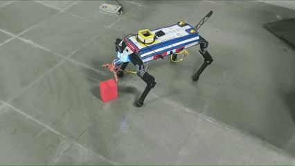
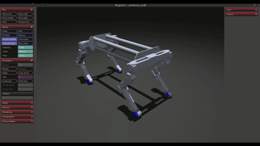

 
# CERBRUS: Open-Source Ant-Inspired Quadruped
**A 14-DoF Bio-Inspired Robot with Front-Mounted Manipulation and ROS 2 Integration. Inspired by nature, engineered for autonomy.**

[](https://docs.ros.org/en/jazzy/) 
[](https://opensource.org/licenses/MIT)
[](https://www.python.org/)

---

## 📋 Overview
Most quadruped robots treat manipulation as a secondary attachment, often resulting in a high center of gravity and reduced stability. **CERBRUS** re-engineers this approach by mimicking **ant morphology**, integrating a **2-DoF gripper at the front "mandibles."** This design optimizes the center of mass for pick-and-place tasks and enables interaction in narrow environments where top-mounted arms traditionally struggle.

> **Note:** This project is currently in active development at the intersection of bio-inspired hardware and autonomous perception.

---

## ✨ Key Features
* **Ant-Inspired Morphology:** Front-mounted 2-DoF gripper for stable, organic manipulation.
* **14 Degrees of Freedom:** 3-DoF per leg + 2-DoF gripper for high-fidelity gait control and interaction.
* **ROS 2 Native:** Built on **Jazzy Jalisco**, utilizing a modular node architecture for telemetry, control, and perception.
* **Active Balancing:** Real-time PID-based posture correction using **BNO055 IMU** data for terrain adaptation.
* **Edge-Ready Compute:** Powered by **Raspberry Pi 5** for high-level logic and Arduino microcontrollers for low-level actuator PWM.

---

## 🛠 Hardware Architecture

| Component | Specification |
| :--- | :--- |
| **Main Processor** | Raspberry Pi 5 (8GB) running Ubuntu 24.04 |
| **Microcontrollers** | Arduino Mega (Gait/Leg Kinematics) & Arduino Nano (Gripper) |
| **Sensors** | Bosch BNO055 (9-axis IMU), Voltage/Current Telemetry |
| **Actuators** | 14x High-torque Metal Gear Servos |
| **Communication** | HC-12 Long Range Radio / Custom Handheld Controller |
| **Chassis** | Modular 3D-printed design optimized for payload-to-weight ratio |

---

## 💻 Software & Installation

### Prerequisites
* **OS:** Ubuntu 24.04 (Noble Numbat)
* **Middleware:** ROS 2 Jazzy Jalisco
* **Language:** Python 3.10+ / C++ 17

### Quick Start
```bash
# Please read the report pasted at the bottom of this page for more details on technical implementation and software design.

# Clone the repository and submodules
git clone --recursive [https://github.com/Mandred009/CERBRUS-OpenSource-Quadruped.git](https://github.com/Mandred009/CERBRUS-OpenSource-Quadruped.git)
cd CERBRUS-OpenSource-Quadruped

# Install ROS 2 dependencies
rosdep install --from-paths src --ignore-src -r -y

# Build the workspace
colcon build --symlink-install
source install/setup.bash

# Launch the core controller and telemetry
ros2 launch cerbrus_bringup cerbrus.launch.py

# To Launch the Mujoco sim
ros2 launch cerbrus_sim robot.launch.py
```
### Research & Development Roadmap
CERBRUS serves as an open-source testbed for several advanced robotics research trajectories:

[1] Perception-Driven Grasping: Integrating lightweight Vision-Language Models (VLMs) for semantic object identification and autonomous retrieval.

[2] Unsupervised Navigation: Utilizing edge-based topology prediction and structural manifolds for obstacle avoidance in unstructured environments.

[3] Reinforcement Learning: Developing high-fidelity digital twins in NVIDIA Isaac Sim to train gait policies for deployment on physical hardware

and much more.

### Contributing
We welcome contributions from the robotics community! Whether it’s gait optimization, CV-based SLAM, or hardware refinement:

1) Fork the repository.

2) Create your Feature Branch (git checkout -b feature/AmazingFeature).

3) Commit your changes (git commit -m 'Add some AmazingFeature').

4) Push to the branch (git push origin feature/AmazingFeature).

5) Open a Pull Request.

[Demo Video](https://youtu.be/7aDOSGi9X7s?si=jsZ_k7eUMPky-3Gf)

[Cerbrus Report](https://drive.google.com/file/d/167SGrlnD2wC8xEmvnSjF_YPM4pek4O9T/view?usp=sharing)

[CAD Files](https://drive.google.com/drive/folders/1i38UzL1JV2BpZAZQdjU2TJO_qoiLwZAB?usp=sharing)
